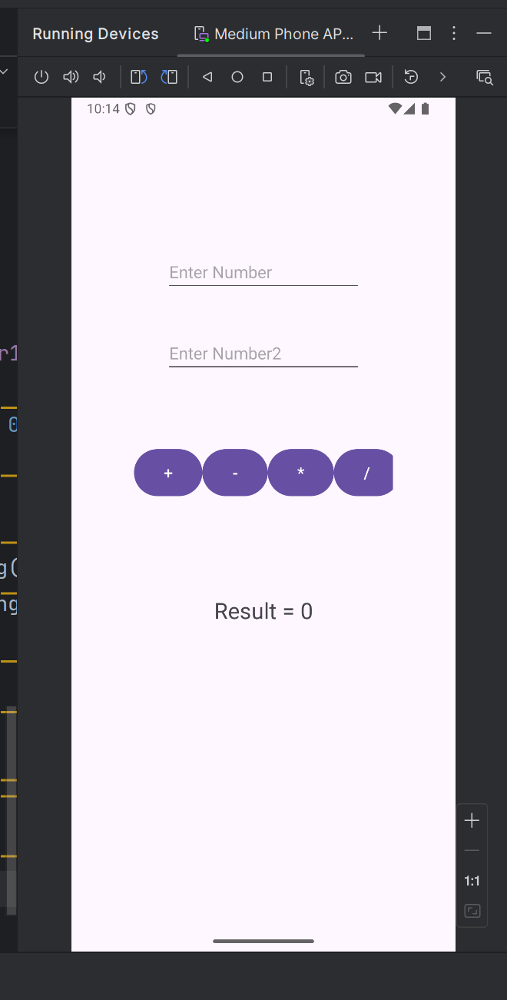
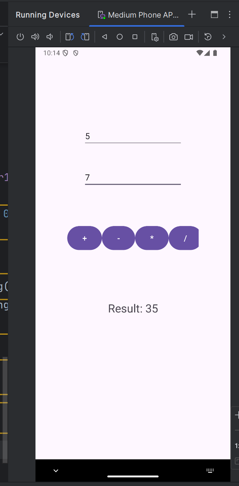

###### Calculator - Java ile Temel Aritmetik İşlemler
Bu proje, Java dilinde yazılmış basit bir hesap makinesidir. Kullanıcıdan alınan girdilerle toplama, çıkarma, çarpma ve bölme işlemleri yapabilir.

======Özellikler
..*Toplama işlemi
..*Çıkarma işlemi
..*Çarpma işlemi
..*Bölme işlemi

======Kullanım
Projeyi çalıştırın.
İşlem yapmak istediğiniz iki sayıyı ve işlemi seçin:
..* + -> Toplama
..* - -> Çıkarma
..* * -> Çarpma
..* / -> Bölme

### Uygulama Arayüzü

Bu ekran, hesap makinesinin başlangıçta nasıl göründüğünü göstermektedir.

Bu ekran hesap makinesinde 5 * 7 işleminin sonucunu gösteriyor.

Bu ekran hesap makinesinde 5 / 0 işlemini gösteriyor.
